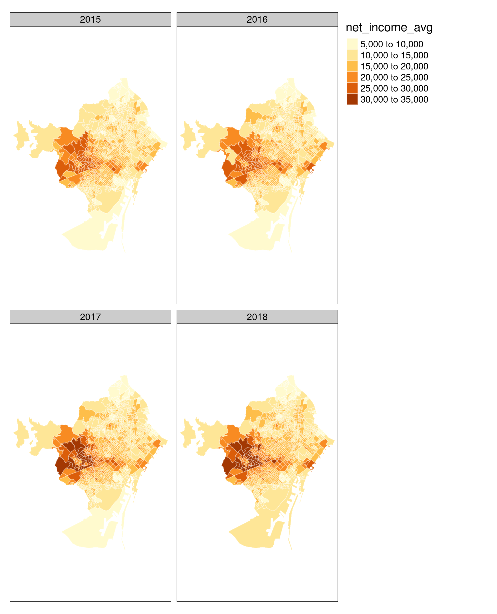

# Area-Level SES Indicators from INE

## Data

---
**NOTE**

The folder `data/` is not tracked by git due to the file size limit of GitHub.
---

The original data is available at INE's website:

<https://www.ine.es/experimental/atlas/exp_atlas_tab.htm>

I downloaded the ZIP files for:

* Indicadores de renta media y mediana

* Índice de Gini y Distribución de la renta P80/P20

Each folder has several files with the data in different formats and shapes. I used the CSV called `csv_bdsc.csv` from each folder and named them, respectively:

* [data/income.csv](data/income_raw.csv)

* [data/gini.csv](data/gini_raw.csv)

I also downloaded the map of Spain by districts (2018) from INE's site:

<https://www.ine.es/ss/Satellite?L=es_ES&c=Page&cid=1259952026632&p=1259952026632&pagename=ProductosYServicios%2FPYSLayout>

I placed the corresponding SHAPE files in `data/maps/ine/`.

I use this map to subset the districts in Catalonia and link the SES indicators with the corresponding district polygons.

## Output

See [ses-ine.R](ses-ine.R) for details on the data cleaning and wrangling.

### Processed data

The processed data set is saved in different formats inside the `data-processed/` folder:

| File                            | Description                                             |
|---------------------------------|---------------------------------------------------------|
| `data-processed/ses_cat.csv`    | SES indicators by section in Catalonia                  |
| `data-processed/ses_cat.rds`    | `tibble` with SES indicators by section in Catalonia    |
| `data-processed/ses_cat_sf.rds` | `sf` object with SES indicators by section in Catalonia |

The SES indicators reported in this data set are:

| Variable                   | Description                     | Units |
|----------------------------|---------------------------------|-------|
| `net_income_avg`           | Average net income by person    | Euros |
| `net_income_avg_household` | Average net income by household | Euros |
| `gini`                     | Gini Index                      |       |
| `p80_p20`                  | P80/P20 income distribution     |       |

### Maps

The maps are saved in the `figs/` folder.

